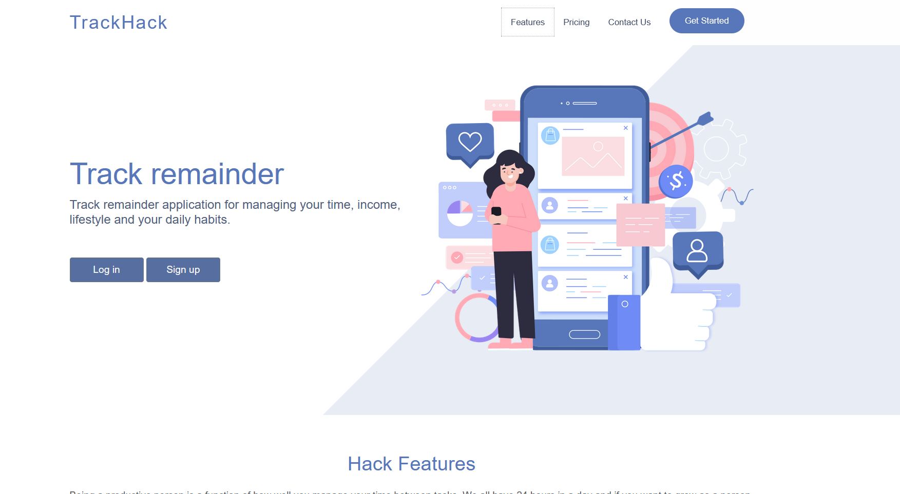

# TO-DO, Notes and daily remainders 

This project is a todo application where you can add your notes and daily remainders.

You need to login/signup with an email and track your calendar.

You will get email notification's for your remainders.

There is calendar as well :)

<i> You can just donwload the zip, and open the project. </i>

dairlytrackapp => main application

webdemo=> module of the app

<b> Design source: Appland Bootstrap landing page  </b>

Index page looks like this, the user have opportunity to log in or register if he is not registered yet and track his/her schedule.

